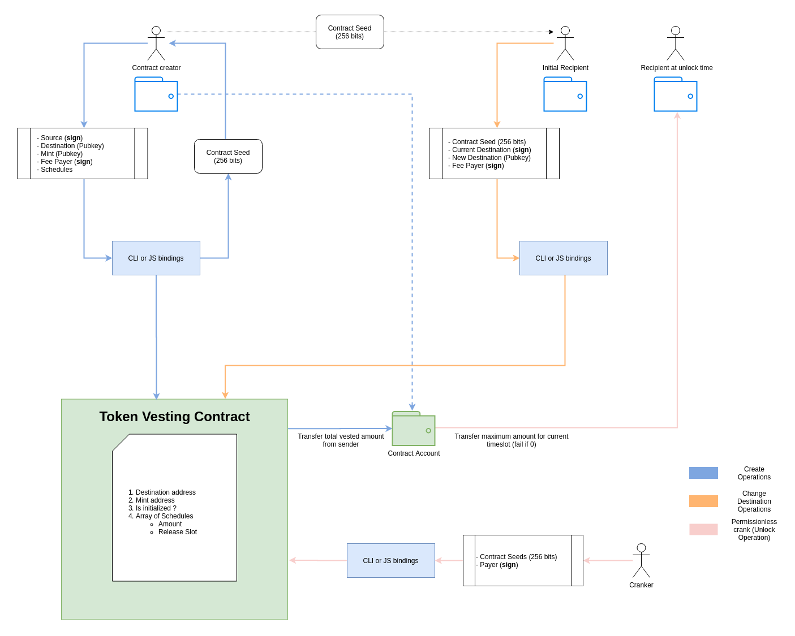

## ⚠️ Warning

This code is unaudited use at your own risk.

# Token vesting contract

## Goal

- Simple vesting contract (SVC) that allows you to deposit X SPL tokens that are unlocked to a specified public key at a certain block height/ slot.
- Unlocking works by pushing a permissionless crank on the contract that moves the tokens to the pre-specified address
- Token Address should be derived from https://spl.solana.com/associated-token-account
- 'Vesting Schedule contract' - A contract containing an array of the SVC's that can be used to develop arbitrary- vesting schedules.
- Tooling to easily setup vesting schedule contracts
- Recipient address should be modifiable by the owner of the current recipient key
- Implementation should be a rust spl compatible program, plus client side javascript bindings that include a CLI- interface. Rust program should be unit tested and fuzzed.

## Structure

- `cli` : CLI tool to interact with on-chain token vesting contract
- `js` : JavaScript binding to interact with on-chain token vesting contract
- `program` : The BPF compatible token vesting on-chain program/smart contract

